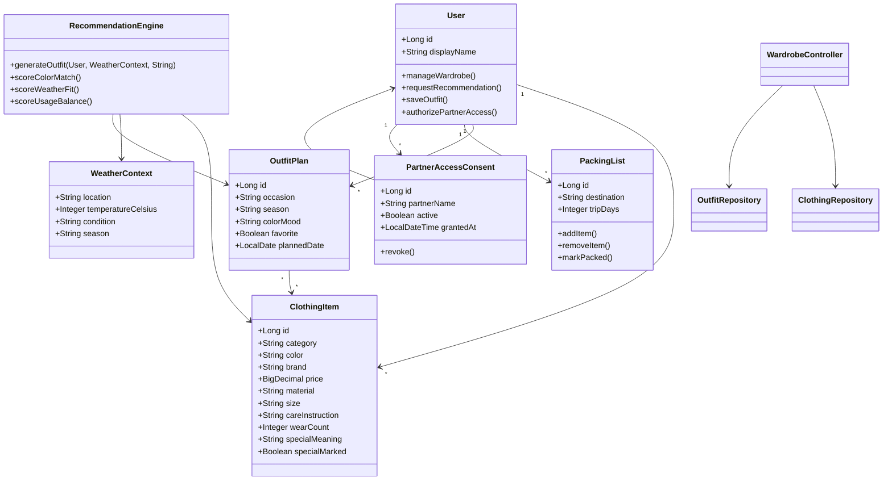

# Tao Wang | Software Development Learning Portfolio

> DE zuerst, EN second. This profile is structured as an application portfolio for internships, IHK preparation, and long-term software engineering growth.

## Ueberblick (DE)

Ich bin Umschuelerin zur Fachinformatikerin fuer Anwendungsentwicklung in Deutschland.  
Dieses GitHub-Profil ist mein zentrales Portfolio mit klarer Trennung von **Lernstruktur**, **Projekten**, **IHK AP1 Vorbereitung**, **Java/Backend Training**, **Frontend/PWA Projekten** und **CPS/Arduino Labs**.

Mein Fokus liegt auf praktischen, erklaerbaren Projekten: nicht nur UI-Demos, sondern kleine Produkte mit Zielgruppe, Use Cases, Datenmodell, technischer Umsetzung und Erweiterungsideen.

## Snapshot

| Bereich | Fokus | Link |
|---|---|---|
| Learning Hub | Roadmap, Wochenziele, Lernfortschritt, Courses Lernfelder 1-9 | [IT-Learning-Journey](https://github.com/lilarosa/IT-Learning-Journey) |
| IHK AP1 Prep | Aufgaben, Loesungen, Mock Exams, Wiederholungsplan | [ihk-ap1-prep](https://github.com/lilarosa/ihk-ap1-prep) |
| Java Projects | OOP, CLI, Fehlerbehandlung, kleine Anwendungen | [java-projects](https://github.com/lilarosa/java-projects) |
| Backend Training | Testbare Java-Projekte und API-Grundlagen | [backend-mini-projects-java](https://github.com/lilarosa/backend-mini-projects-java) |
| Algorithm Training | Java DSA fuer AP1 und Interviews | [algorithm-training-java](https://github.com/lilarosa/algorithm-training-java) |
| Linux/DevOps Labs | Linux, Shell, Git, spaeter Docker | [devops-linux-labs](https://github.com/lilarosa/devops-linux-labs) |
| Arduino Projects | CPS, Sensoren, Aktoren, Breadboard-Uebungen | [Arduino-Projects](https://github.com/lilarosa/Arduino-Projects) |
| Frontend Projects | PWA/Web-Apps fuer konkrete Alltagsszenarien | [frontend-projects](https://github.com/lilarosa/frontend-projects) |

## Featured Projects (Selbst entwickelt)

| Project | Product Focus | Main Stack | Demo / Repo |
|---|---|---|---|
| Smart Outfit | Private-first wardrobe app with outfit recommendations, weather context, packing lists, item details, favorites, and optional partner integration concept | Java 21, Spring Boot, JPA, PostgreSQL, HTML/CSS/JS, Flutter scaffold | [Demo](https://lilarosa.github.io/smartoutfit/) / [Repo](https://github.com/lilarosa/smartoutfit) |
| Chinese Learning Website | Interactive Chinese learning portal for children with characters, pinyin, games, poem practice, homework and attendance support | HTML, CSS, JavaScript | [Demo](https://lilarosa.github.io/frontend-projects/projects/01_chinesisch-lernen/) / [Repo](https://github.com/lilarosa/frontend-projects) |
| Hungary Survival Guide | Practical PWA for newcomers and expats in Hungary with language, health, safety, leisure and administration modules | HTML, CSS, JavaScript, localStorage, PWA | [Demo](https://lilarosa.github.io/frontend-projects/projects/02_hungary-survival/) / [Repo](https://github.com/lilarosa/frontend-projects) |
| CareU | Elder-care companion prototype with reminders, daily routines, call shortcuts, reading mode and a memory game | HTML, CSS, JavaScript, PWA, Service Worker | [Demo](https://lilarosa.github.io/frontend-projects/projects/03_careU/) / [Repo](https://github.com/lilarosa/frontend-projects) |
| AP1 Study App | Exam preparation PWA for Fachinformatiker AP1 with modules, weekly planning, quizzes and checklists | HTML, CSS, JavaScript, PWA | [Demo](https://lilarosa.github.io/frontend-projects/projects/04_ap1-study-app/) / [Repo](https://github.com/lilarosa/frontend-projects) |
| CPS Greenhouse | Cyber-physical Arduino greenhouse: sensors control actuators and display environmental feedback | Arduino/C++, sensors, pump, LED, RTC/LCD | [Docs](https://github.com/lilarosa/Study-notes/blob/main/projects/CPS/docs/cps-graphic-mapping.md) |
| Temperature Fan Control | Arduino mini CPS project with NTC temperature sensing, LED feedback and fan control with hysteresis | Arduino/C++, NTC, fan, LED | [Sketch](https://github.com/lilarosa/Arduino-Projects/tree/main/sketches/05_temperature_fan_control) |

## Project Notes for Interviews

### 1. Smart Outfit - Private Wardrobe Intelligence

**Problem:** Many people own enough clothes but still struggle to decide what to wear, what to pack, what is rarely used, and what actually matches their personal style.

**Solution:** Smart Outfit is designed as a private-first wardrobe assistant. Users can import clothing items, manage detailed item profiles, get outfit recommendations based on weather and scenario, save favorite outfits, create editable travel packing lists, track outfit usage, and optionally prepare anonymized/authorized data for future retail partner integrations.

**What I can explain in an interview:**

- Product thinking: wardrobe management, outfit recommendations, packing, usage tracking, duplicate-shopping prevention and wardrobe gap analysis.
- Data modeling: clothing item metadata, outfit plans, calendar records, favorites, weather context and consent-based partner access.
- Backend thinking: Spring Boot controllers, persistence layer, local-first/privacy-first design direction and future API boundaries.
- Frontend thinking: responsive web/PWA structure, user flows for wardrobe, recommendations, item detail pages, calendar and packing list editing.
- Compliance awareness: minimize sensitive data, avoid unnecessary cloud storage, keep partner access consent-based and revocable.

**Smart Outfit UML overview:**

### 2. Chinese Learning Website

**Goal:** A friendly learning website for children who are learning Chinese step by step.

**Main functions:** character learning, pinyin practice, small games, poem practice, calendar/check-in support, homework and contact pages.

**Interview angle:** This project shows how I translate a real learning scenario into a usable frontend structure: child-friendly navigation, repeated practice, visual feedback, and separate pages for learning, homework and communication.

### 3. Hungary Survival Guide

**Goal:** A practical survival guide for newcomers, students and expats living in Hungary.

**Main functions:** daily-life guidance, language help, health and safety information, leisure ideas, local administration tips and PWA-style offline-friendly usage.

**Interview angle:** This project shows product structuring for a real target group. It is not only a static website; it is organized around user problems such as "I need help quickly", "I need the right phrase", or "I need to understand a local process".

### 4. CareU

**Goal:** A simple elder-care companion prototype for daily support and family-friendly reminders.

**Main functions:** current time and greeting, medicine/meal/task reminders, call shortcuts for friend/family/emergency support, daily reading with speech synthesis, and a memory-match game for light cognitive activity.

**Interview angle:** CareU is useful for discussing accessibility, readable UI, high-contrast interaction, simple workflows and emotionally careful product design.

### 5. AP1 Study App

**Goal:** A focused study assistant for the Fachinformatiker AP1 exam.

**Main functions:** topic modules, weekly plan, quiz/checklist workflow and structured revision support.

**Interview angle:** This project connects my own training path with software development: I use software to organize learning, track weak areas and create a repeatable preparation workflow.

### 6. CPS Greenhouse

**Goal:** A cyber-physical system that reacts to environmental input.

**Main functions:** light and soil-moisture sensing, actuator control with LED/pump, RTC/LCD feedback and audio/status output.

**Interview angle:** This project is useful for explaining sensor-actuator logic, input processing, state mapping and the connection between physical systems and software behavior.

### 7. Temperature Fan Control

**Goal:** A compact Arduino control system for temperature-based fan behavior.

**Main functions:** NTC temperature reading, threshold-based control, LED state feedback and hysteresis to avoid unstable switching.

**Interview angle:** This project is useful for explaining control logic, edge cases, stable thresholds and why hysteresis matters in real hardware systems.

## Lernstruktur

| Kategorie | Repositories |
|---|---|
| Courses | [IT-Learning-Journey](https://github.com/lilarosa/IT-Learning-Journey) |
| Notes | [Study-notes](https://github.com/lilarosa/Study-notes) |
| Labs | [Linux-Week1-Lab](https://github.com/lilarosa/Linux-Week1-Lab), [DHCP-Apache-Webserver_Week2_Lab](https://github.com/lilarosa/DHCP-Apache-Webserver_Week2_Lab) |
| Projects | [frontend-projects](https://github.com/lilarosa/frontend-projects), [smartoutfit](https://github.com/lilarosa/smartoutfit), [Arduino-Projects](https://github.com/lilarosa/Arduino-Projects) |

## Aktuelle Ziele (2026)

- AP1 systematisch vorbereiten: SQL, Java, UML, Testing, Netzwerke und IT-Grundlagen
- Java von Uebungsniveau zu testbaren Mini-Projekten entwickeln
- Spring Boot und Datenbankgrundlagen in nachvollziehbaren Projekten anwenden
- Frontend/PWA Projekte mit klaren Nutzerflows, README-Dokumentation und Live-Demos pflegen
- Linux/DevOps Grundlagen in reproduzierbaren Labs festigen

## Profile (EN)

I am retraining as a software developer in Germany. This profile is my learning and project portfolio, organized into learning hubs, notes, labs, frontend projects, Java/backend practice, CPS/Arduino work and application-oriented demo projects.

I focus on projects that are explainable in interviews: each project should have a target user, a clear problem, a usable interface, a technical structure and realistic next steps.

## 2026 Focus (EN)

- Structured IHK AP1 preparation
- Java progression from exercises to testable mini-projects
- Spring Boot and database fundamentals through practical apps
- Frontend/PWA projects with clear user flows and live demos
- Reproducible Linux/DevOps labs
- Consistent repository documentation and project storytelling

## Contact

- GitHub: [@lilarosa](https://github.com/lilarosa)
